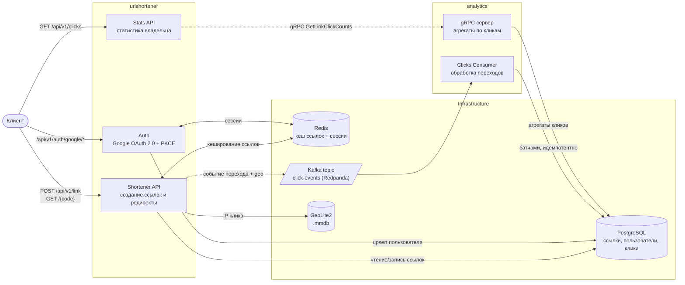

# url-shortener

Укорачиватель ссылок на Go — с авторизацией через Google, кешированием редиректов в Redis и асинхронной аналитикой переходов на отдельном gRPC-сервисе. Архитектура на интерфейсах позволяет подменить любую технологию (Postgres, Redis, Kafka) без изменения бизнес-логики.


[](https://github.com/vladislav-koval/url-shortener/actions/workflows/test.yml)

## Что это

Сервис принимает длинный URL, отдаёт короткий код и по этому коду редиректит обратно на оригинал. Ничего необычного как продукт — необычное здесь то, **как это собрано**: проект специально написан как учебная площадка для отработки чистой слоистой архитектуры на Go, service-to-service взаимодействия по gRPC и работы с реальной асинхронной инфраструктурой.

Два независимых сервиса:

- **`urlshortener`** — HTTP API: создание ссылок, редиректы, авторизация через Google, отдача статистики владельцу ссылки.
- **`analytics`** — gRPC-сервис: консьюмит события кликов из Kafka, идемпотентно пишет их в Postgres, отдаёт агрегаты по gRPC.

Основные сценарии:

- **Создание короткой ссылки** — `POST /api/v1/link`, код генерируется криптографически стойким `crypto/rand`, коллизии решаются ретраем на уникальном ограничении БД. Ссылку можно создать анонимно или под своим аккаунтом (тогда она попадёт в статистику пользователя). Целевой URL не может быть IP-адресом, `localhost` или собственным доменом сервиса (включая поддомены) — защита от бессмысленных/мусорных ссылок.
- **Редирект** — `GET /{code}`, сначала смотрит в Redis, при промахе идёт в Postgres и прогревает кеш. При переходе страна и город определяются по локальной GeoLite2-базе, после чего событие неблокирующе ставится во внутреннюю очередь Kafka-writer'а.
- **Авторизация** — Google OAuth 2.0 с PKCE, сессии хранятся в Redis (не JWT), выдаются по HttpOnly-cookie.
- **Аналитика** — консьюмер `analytics` батчами и идемпотентно (`ON CONFLICT DO NOTHING`) пишет клики в Postgres; `urlshortener` дергает `analytics` по gRPC и отдаёт владельцу список его ссылок с числом кликов на каждую, с пагинацией (`GET /api/v1/clicks`).

## Технические решения

**Каждая технология подключена через интерфейс, а не напрямую.** Бизнес-логика не знает про `pgx`, `go-redis`, `kafka-go` или `golang.org/x/oauth2` — только про свои интерфейсы (`pool.Pool`, `cache.Pool`, `gokafka.Writer`, `service.IdentityProvider`...). Конкретные реализации собираются в одном месте на сервис — `cmd/urlshortener/main.go` и `cmd/analytics/main.go`, — так что замена технологии не требует правок в фичах.

**Аналитика вынесена в отдельный сервис, а не в горутину внутри монолита.** `analytics` можно масштабировать, деплоить и перезапускать независимо от `urlshortener` — консьюмер, который пишет клики, никак не влияет на доступность редиректов. Связь между сервисами — gRPC с ретраями и per-попытка таймаутом на клиенте (`GRPC_CLIENT_MAX_RETRIES`, `GRPC_CLIENT_PER_TIMEOUT`), interceptor'ы на сервере — логирование, паника-рекавери, валидация запроса через `protoc-gen-validate` до того, как запрос дойдёт до бизнес-логики.

**Запись клика не зависит от контекста HTTP-запроса.** `RecordClick` не принимает request context и неблокирующе кладёт событие в ограниченную внутреннюю очередь Kafka-writer'а. Фактическая запись в Kafka выполняется фоновой горутиной, поэтому отмена HTTP-запроса клиентом (закрыл вкладку, мобильная сеть) не отменяет уже поставленное в очередь событие. Kafka-writer сам батчит сообщения поверх **ограниченной** очереди (`QueueSize`) — без `Async: true` и без неограниченной очереди `kafka-go`. Компромисс в другую сторону: лучше потерять клик при переполнении очереди, чем уронить процесс OOM'ом на маленьком сервере; потери не тихие — считаются и периодически логируются (`Writer.Dropped()`). На стороне консьюмера — свой ретрай перед коммитом оффсетов: батч, который не удалось сохранить в Postgres, повторяется с бэкоффом, а не роняет консьюмер.

**Сбой GeoIP не ломает редирект.** Резолвинг страны/города выполняется синхронно по локальной GeoLite2-базе. Ошибка lookup логируется, но не прерывает редирект: событие отправляется с пустыми geo-полями. Если база недоступна при старте и `GEO_REQUIRED=false`, используется `NoopResolver`.

**Маппинг ошибок библиотек тестируется в два слоя.** Каждый адаптер (`pgx`, `go-redis`) транслирует ошибки библиотек в свои сентинелы (`pool.ErrNotFound`, `cache.ErrNotFound`...). Тест на голую функцию маппинга не ловит случай "забыли вызвать маппер внутри метода-обёртки" — код компилируется, ошибка просто перестаёт совпадать выше по стеку. Поэтому тесты идут парой: маппер отдельно и обёртка, которая доказывает, что маппер реально вызывается.

**Отказ кеша не роняет запрос.** Если Redis недоступен при чтении или записи кеша, сервис логирует это и продолжает работать через Postgres напрямую. Это поведение покрыто тестами, включая разницу между обычным промахом кеша (`ErrNotFound`, ничего не логируется) и реальным сбоем Redis (логируется) — это разные, отдельно протестированные ветки.

**Таймаут — на каждый блокирующий вызов отдельно, а не один общий на запрос.** `http.Server` настроен через `HTTP_READ_HEADER_TIMEOUT`/`HTTP_READ_TIMEOUT`/`HTTP_WRITE_TIMEOUT`/`HTTP_IDLE_TIMEOUT` (защита от медленного клиента). Плюс свой таймаут на каждый внешний вызов: `POSTGRES_TIMEOUT` (`pool.OpTimeout()`), `GRPC_CLIENT_PER_TIMEOUT` с ретраями, `GOOGLE_AUTH_EXCHANGE_TIMEOUT` на обмен кода и валидацию `id_token`.

## Архитектура



## Стек

| Слой | Технология |
|---|---|
| Язык | Go 1.26 |
| HTTP | `net/http` + свой роутер/middleware (CORS, RequestID, структурные логи, паника-рекавери, auth) |
| gRPC | `google.golang.org/grpc`, валидация через `protoc-gen-validate`, кодогенерация — `easyp` |
| БД | PostgreSQL 18, `jackc/pgx/v5`, миграции — `golang-migrate` |
| Кеш / сессии | Redis 8, `redis/go-redis/v9` |
| Очередь | Redpanda (single-node, Kafka wire-протокол), `segmentio/kafka-go` |
| Авторизация | Google OAuth 2.0 + PKCE (`golang.org/x/oauth2`, `google.golang.org/api/idtoken`) |
| GeoIP | MaxMind GeoLite2 City, `oschwald/geoip2-golang` |
| Логирование | `go.uber.org/zap`, структурные JSON-логи с `request_id` |
| Конфигурация | `kelseyhightower/envconfig`, свой `Config` на каждый пакет |
| Валидация | `go-playground/validator/v10` (HTTP), `protoc-gen-validate` (gRPC) |
| Тесты | `stretchr/testify`, `go.uber.org/mock` (`mockgen`) |
| Инфраструктура | Docker Compose. Один файл описывает и dev-инфру (Postgres, Redis, Redpanda), и полный прод-стек (+ Caddy, `shortener`, `analytics`, `frontend`) — для локальной разработки нужно явно перечислить нужное подмножество сервисов, см. "Локальная разработка" |

## API

### `urlshortener`

| Метод | Путь | Описание |
|---|---|---|
| `POST` | `/api/v1/link` | Создать короткую ссылку. Тело: `{"url": "https://example.com"}` → `201` `{"short_code": "...", "original_url": "..."}`. Если запрос авторизован — ссылка привязывается к пользователю. |
| `GET` | `/{code}` | Редирект на оригинальный URL (`302`), либо `404 not_found`. Без версии — короткая ссылка не должна тащить на себе `/api/v1`. |
| `GET` | `/api/v1/auth/google/login` | Начало OAuth-флоу, редирект на Google. |
| `GET` | `/api/v1/auth/google/callback` | Callback от Google, обмен кода на токен, выдача сессионной cookie. |
| `POST` | `/api/v1/auth/logout` | Завершить сессию. |
| `GET` | `/api/v1/clicks` | Ссылки текущего пользователя с числом кликов на каждую (пагинация): `{"items": [{"short_code": "...", "original_url": "...", "click_count": 0, "created_at": "..."}], "total": 0}`. Требует авторизации. |

Ошибки — единый JSON-контракт (`{"code": "...", "message": "...", "details": [...]}`), собственный текст ошибки клиенту никогда не уходит, только в лог.

### `analytics` (gRPC, внутренний)

| RPC | Описание |
|---|---|
| `GetLinkClickCounts(short_codes[])` | Вернуть число кликов по списку коротких кодов (до 100 за раз). Используется `urlshortener` для `/api/v1/clicks`, наружу не выставлен. |

## Локальная разработка

На проде всё (`caddy`, `shortener`, `analytics`, `frontend` + инфра) поднимается вместе в докер-контейнерах через один `docker-compose.yml`. Локально бэкенд удобнее гонять нативно (`go run`), а в докере держать только инфраструктуру:

```bash
cp .env.example .env
make env-dev-up          # поднимает Postgres, Redis, Redpanda + port-forwarder (доступ к Postgres с хоста)
make migrate-up          # применяет миграции
make kafka-topic-init    # создаёт Kafka-топик (idempotent)
make run                 # go mod tidy && go run ./cmd/urlshortener
make run-analytics       # в отдельном терминале: go mod tidy && go run ./cmd/analytics
```

`urlshortener` поднимется на `HTTP_ADDR` из `.env` (по умолчанию `:5050`), `analytics` слушает gRPC на `GRPC_ADDR` (по умолчанию `:50051`).

`docker-compose.yml` содержит не только инфраструктуру, но и полный прод-стек (`caddy`, `shortener`, `analytics`, `frontend`) — эти сервисы без `profiles`, поэтому голый `make env-up` (`docker compose up -d`) поднимет и их тоже, включая сборку `frontend` из соседнего репозитория `../url-shortener-front`. Для локальной разработки бэкенда используй `make env-dev-up`, а не `make env-up`.

**GeoIP-база.** Резолвинг страны/города по IP клика использует локальную базу MaxMind GeoLite2 City в формате `.mmdb`. Файл не лежит в репозитории:

1. Завести бесплатный аккаунт на [maxmind.com](https://www.maxmind.com/en/geolite2/signup) и сгенерировать license key.
2. Скачать `GeoLite2-City.mmdb` (вручную через личный кабинет или через `geoipupdate`).
3. Положить файл по пути из `GEO_FILE_PATH` в `.env` (по умолчанию `data/geo-city.mmdb`, директория `data/` в `.gitignore`).

Если файла нет и `GEO_REQUIRED=false` (по умолчанию) — сервис стартует, но клики пишутся без страны/города. При `GEO_REQUIRED=true` отсутствие базы — фатальная ошибка при старте.

**Google OAuth.** Нужен OAuth-клиент в [Google Cloud Console](https://console.cloud.google.com/apis/credentials) с redirect URI, равным `GOOGLE_AUTH_CALLBACK_URL` из `.env`. `GOOGLE_AUTH_CLIENT_ID` / `GOOGLE_AUTH_CLIENT_SECRET` — оттуда же.

## Тестирование

```bash
go test ./...
go vet ./...
```

Юнит-тесты покрывают весь путь от бизнес-логики до адаптеров технологий: сервисный слой (табличные тесты с моками через `go.uber.org/mock`), кеширующий репозиторий (cache-hit/miss/деградация, включая проверку факта логирования через `zap/zaptest/observer`), маппинг ошибок обоих драйверов — Postgres и Redis — в два слоя (сама функция маппинга + доказательство, что обёртка её реально вызывает), а также gRPC-хендлеры и Google OAuth провайдер. Real-DB-путь (реальный `pgxpool.Pool`, реальное сетевое подключение) осознанно вынесен за границу юнит-тестов — это территория будущего интеграционного слоя на `testcontainers-go`.

## Структура проекта

```
cmd/
  urlshortener/            — точка сборки HTTP-сервиса, здесь и только здесь конкретные технологии
  analytics/                — точка сборки gRPC-сервиса аналитики
api/
  proto/                     — .proto контракты
  gen/                       — сгенерированный gRPC/validate код (easyp)
internal/
  platform/                  — технологии (Postgres/Redis/Kafka/HTTP/gRPC), домен, общие ошибки, geo, авторизация
    repository/postgres/pool     — интерфейс pool.Pool + драйвер pgx
    repository/redis              — интерфейс cache.Pool + драйвер goredis
    messaging/gokafka              — интерфейс Writer/Reader + драйвер segmentio
    transport/grpc                 — сервер, клиент, interceptor'ы
  shortener/                 — HTTP-сервис urlshortener
    urls/                         — создание ссылок, редирект, продюсер кликов
    auth/                          — Google OAuth, сессии
    stats/                         — статистика владельца (gRPC-клиент к analytics)
  analytics/                 — gRPC-сервис analytics
    clicks/                       — консьюмер кликов, сохранение в Postgres
    stats/                         — gRPC-хендлер агрегатов
migrations/                  — golang-migrate SQL-миграции
```

Подробные архитектурные соглашения (нейминг, где объявляются интерфейсы, паттерны конфигурации) описаны в [CLAUDE.md](CLAUDE.md).

## Что дальше

- Интеграционные тесты на `testcontainers-go` поверх реального Postgres/Redis/Kafka.
- Prometheus-метрики (латентность редиректа, cache hit-rate, lag консьюмера).
- График кликов по времени и разбивка по странам/городам в `/api/v1/clicks` — данные уже пишутся, агрегации по времени пока нет.