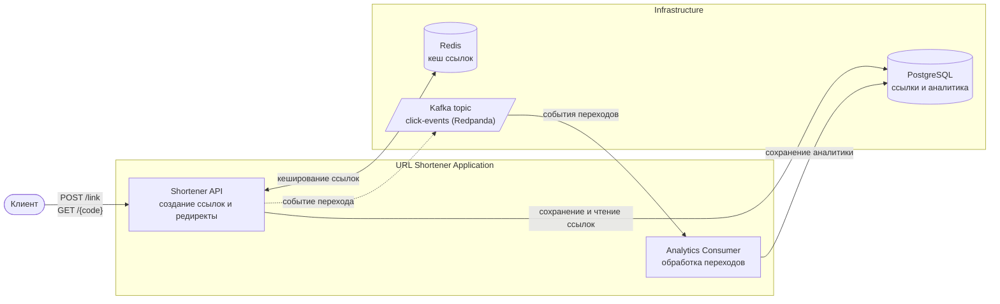

# url-shortener

Укорачиватель ссылок на Go — с кешированием в Redis, асинхронным трекингом кликов через Kafka и продуманной архитектурой на интерфейсах, которая позволяет подменить любую технологию (Postgres, Redis, Kafka) без изменения бизнес-логики.


[](https://github.com/vladislav-koval/url-shortener/actions/workflows/test.yml)

## Что это

Сервис принимает длинный URL, отдаёт короткий код, и по этому коду редиректит обратно на оригинал. Ничего необычного как продукт — необычное здесь то, **как это собрано**: проект специально написан как учебная площадка для отработки чистой слоистой архитектуры на Go, тестирования через интерфейсы и работы с реальной асинхронной инфраструктурой (не тойовой).

- **Создание короткой ссылки** — `POST /link`, код генерируется криптографически стойким `crypto/rand`, коллизии решаются ретраем на уникальном ограничении БД.
- **Редирект** — `GET /{code}`, сначала смотрит в Redis, при промахе идёт в Postgres и прогревает кеш.
- **Трекинг кликов** — каждый переход асинхронно, не блокируя редирект пользователя, публикуется в Kafka и обрабатывается отдельным консьюмером, который батчами и идемпотентно (`ON CONFLICT DO NOTHING`) пишет клики в Postgres.

## Технические решения

**Каждая технология подключена через интерфейс, а не напрямую.** Бизнес-логика не знает про `pgx`, `go-redis` или `kafka-go` — только про свои интерфейсы (`pool.Pool`, `cache.Pool`, `gokafka.Writer`). Конкретные реализации собираются в одном месте, `cmd/urlshortener/main.go`, так что замена технологии не требует правок в фичах.

**Запись клика не завязана на контекст HTTP-запроса.** `RecordClick` вызывается из хендлера редиректа, но использует `context.Background()`, а не контекст входящего запроса. `Redirect` — момент, где клиент может оборвать соединение (закрыл вкладку, мобильная сеть), и если бы запись в Kafka зависела от его контекста, клик терялся бы из-за поведения браузера, а не проблем с Kafka. Kafka-writer сам батчит сообщения поверх **ограниченной** очереди (`QueueSize`) — без `Async: true` и без неограниченной очереди `kafka-go`. Компромисс в другую сторону: лучше потерять клик при переполнении очереди, чем уронить процесс OOM'ом на маленьком сервере; потери не тихие — считаются и периодически логируются (`Writer.Dropped()`).

**Маппинг ошибок библиотек тестируется в два слоя.** Каждый адаптер (`pgx`, `go-redis`) транслирует ошибки библиотек в свои сентинелы (`pool.ErrNotFound`, `cache.ErrNotFound`...). Тест на голую функцию маппинга не ловит случай "забыли вызвать маппер внутри метода-обёртки" — код компилируется, ошибка просто перестаёт совпадать выше по стеку. Поэтому тесты идут парой: маппер отдельно и обёртка, которая доказывает, что маппер реально вызывается.

**Отказ кеша не роняет запрос.** Если Redis недоступен при чтении или записи кеша, сервис логирует это и продолжает работать через Postgres напрямую. Это поведение покрыто тестами, включая разницу между обычным промахом кеша (`ErrNotFound`, ничего не логируется) и реальным сбоем Redis (логируется) — это разные, отдельно протестированные ветки.

## Архитектура



## Стек

| Слой | Технология |
|---|---|
| Язык | Go 1.26 |
| HTTP | `net/http` + свой роутер/middleware (CORS, RequestID, структурные логи, паника-рекавери) |
| БД | PostgreSQL 18, `jackc/pgx/v5`, миграции — `golang-migrate` |
| Кеш | Redis 8, `redis/go-redis/v9` |
| Очередь | Redpanda (single-node, Kafka wire-протокол), `segmentio/kafka-go` |
| Логирование | `go.uber.org/zap`, структурные JSON-логи с `request_id` |
| Конфигурация | `kelseyhightower/envconfig`, свой `Config` на каждый пакет |
| Валидация | `go-playground/validator/v10` |
| Тесты | `stretchr/testify`, `go.uber.org/mock` (`mockgen`) |
| Инфраструктура | Docker Compose (Postgres, Redis, Redpanda одним поднятием) |

## API

| Метод | Путь | Описание |
|---|---|---|
| `POST` | `/link` | Создать короткую ссылку. Тело: `{"url": "https://example.com"}` → `201` `{"short_code": "...", "original_url": "..."}` |
| `GET` | `/{code}` | Редирект на оригинальный URL (`302`), либо `404 not_found` |

Ошибки — единый JSON-контракт (`{"code": "...", "message": "...", "details": [...]}`), собственный текст ошибки клиенту никогда не уходит, только в лог.

## Быстрый старт

```bash
cp .env.example .env
make env-up          # поднимает Postgres, Redis, Redpanda в docker-compose
make migrate-up       # применяет миграции
make kafka-topic-init # создаёт Kafka-топик (idempotent)
make run              # go mod tidy && go run ./cmd/urlshortener
```

Сервер поднимется на `HTTP_ADDR` из `.env` (по умолчанию `:5050`).

**GeoIP-база.** Резолвинг страны/города по IP клика использует локальную базу MaxMind GeoLite2 City в формате `.mmdb`. Файл не лежит в репозитории

1. Завести бесплатный аккаунт на [maxmind.com](https://www.maxmind.com/en/geolite2/signup) и сгенерировать license key.
2. Скачать `GeoLite2-City.mmdb` (вручную через личный кабинет или через `geoipupdate`).
3. Положить файл по пути из `GEO_FILE_PATH` в `.env` (по умолчанию `data/geo-city.mmdb`, директория `data/` в `.gitignore`).

Без этого файла `urlshortener` не стартует — `geo.NewClient` фейлится при инициализации.

## Тестирование

```bash
go test ./...
go vet ./...
```

Юнит-тесты покрывают весь путь от бизнес-логики до адаптеров технологий: сервисный слой (табличные тесты с моками через `go.uber.org/mock`), кеширующий репозиторий (cache-hit/miss/деградация, включая проверку факта логирования через `zap/zaptest/observer`), и маппинг ошибок обоих драйверов — Postgres и Redis — в два слоя (сама функция маппинга + доказательство, что обёртка её реально вызывает). Real-DB-путь (реальный `pgxpool.Pool`, реальное сетевое подключение) осознанно вынесен за границу юнит-тестов — это территория будущего интеграционного слоя на `testcontainers-go`.

## Структура проекта

```
cmd/urlshortener/        — точка сборки, здесь и только здесь конкретные технологии
internal/core/           — технологии (Postgres/Redis/Kafka/HTTP), домен, общие ошибки
  repository/postgres/pool     — интерфейс pool.Pool + драйвер pgx
  repository/redis             — интерфейс cache.Pool + драйвер goredis
  messaging/gokafka             — интерфейс Writer/Reader + драйвер segmentio
internal/features/
  shortener/              — создание ссылок, редирект, продюсер кликов
  analytics/              — консьюмер кликов, сохранение в Postgres
migrations/               — golang-migrate SQL-миграции
```

Подробные архитектурные соглашения (нейминг, где объявляются интерфейсы, паттерны конфигурации) описаны в [CLAUDE.md](CLAUDE.md).

## Что дальше

- **Авторизация и регистрация пользователей** — без привязки ссылки к владельцу непонятно, кому вообще показывать её статистику.
- **Статистика по ссылкам, доступная только владельцу** — HTTP-эндпоинт поверх уже пишущего консьюмера аналитики:
  - общее число кликов по ссылке;
  - график кликов по времени — когда была активность выше/ниже;
  - разбивка кликов по странам и городам на основе IP (вероятно, локальная GeoIP-база вместо интеграции со внешним сервисом).
- Интеграционные тесты на `testcontainers-go` поверх реального Postgres/Redis/Kafka.
- Таймауты на `http.Server` (`ReadTimeout`/`WriteTimeout`/`IdleTimeout`) — сейчас единственная защита от зависшего хендлера — таймауты самой Kafka-библиотеки и клиента.
